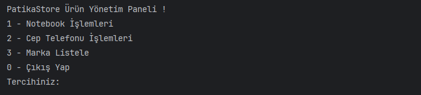
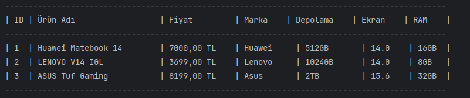
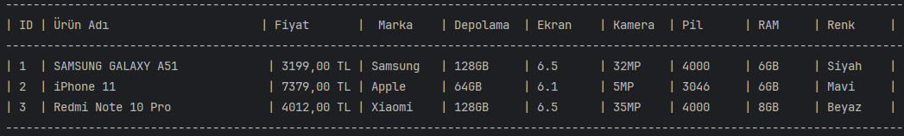
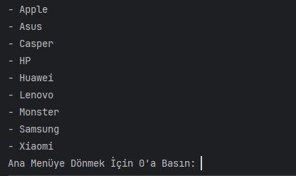
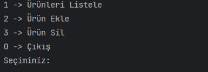

 
<h1 style="text-align:center; color: yellow"> Patika Store </h1> 

 Bu proje Java 17 sürümüyle geliştirildi 

---

<h2 style="text-align:center; color: yellow"> Projenin Açıklaması </h2>

 Bu bir alışveriş sitesi ürün yönetimi backend uygulamasıdır. 
Uygulamanın açılışında kullanıcıyı bir ana menü karşılar ve burada Notebook ile ilgili işlemler, Cep Telefonu ile ilgili işlemler, Markaları listeleme ve uygulamadan çıkma opsiyonları sunulmaktadır
Cep Telefonu veya Notebook sayfaları seçildiğinde kullanıcı buraya ürün ekleyebilir, istediği ürünü silebililir ve ürünlerini listeleyerek doğru bir yönetim sistemi oluşturulabilir.  

 

<h3 style="text-align:center; color: yellow"> Projenin Teknik Detayları </h3> 
Projede Java'nın 17 sürümü kullanıldı ve verilerin tutulması için FIFO mantığına sahip TreeMap kullanıldı böylece kullanıcı verileri sıralı şekilde girerse ekstra bir sıralama alogirtması oluşturma ihtiyacı hissedilmeyecek.
 

 
<h3 style="text-align:center; color: yellow">  Projede Kullanılan Class vb Yapılar </h3>

 Brand() : Markaları ve diğer iki sınıf olan MobilePhone ile Notebook Classlarını kalıtan, birçok ortak özelliğini barındıran abstrack classtır. 
 

 FunctionInterface: Burada birçok ortak fonksiyon gövdesiz şekilde bulunduruldu ve ortak metodlar buradan Override edildi 
 

 MobilePhone() : Bu class mobil cihazlarla ilgili her türlü yönetim işleminin yapıldığı classtır. 
 

 Notebook() : Bu class notebboklarla ilgili her türlü yönetim işleminin yapıldığı classtır. 
 

 Store() : Bu class Notebook ve MobilePhone classlarının tüm fonksiyonlarının kullanıldığı, işlemleri gerçekleştiren ana classtır. 
 

 Main() : Bu class derleyici çalıştırdığımız ve Store classından nesne türeterek programın çalıştırılmasını sağlayan classtır. 

<h3 style="text-align:center; color: yellow">  Proje Görselleri </h3>

 Ana Menü 

 Notebookların Listelenmesi 

 Cep Telefonlarının Listelenmesi 

 Markaların Listelenmesi 

 Notebook Veya Cep Telefonu İle İlgili İşlem Menüsü 

<h4 style="text-align:center; color: yellow"> Contact </h4> 

 <a href="ferhatseker180@gmail.com"> Gmail </a>  
 

 <a href="https://github.com/ferhatseker180"> Github  </a> 
 

 <a href="https://www.linkedin.com/in/ferhat-%C5%9Feker-2410571a4/"> Linkedin </a> 
 
 

